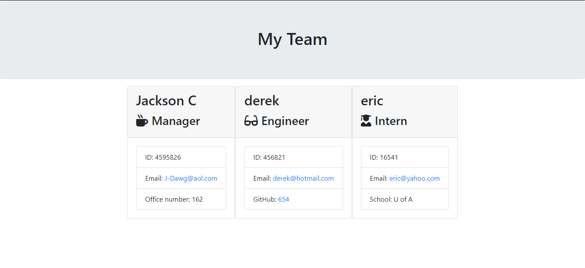
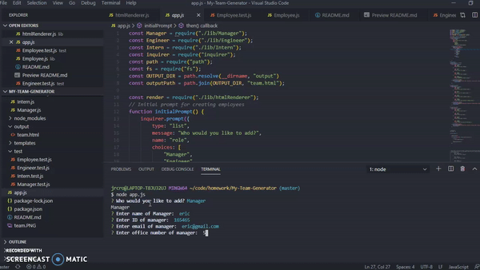

# My-Team-Generator
```
My team generator prompts the user questions to build their "team" with managers, engineers, and interns. The user can add as many as they like. using class constructors the javascript creates the employees and puts them into the pre created HTML templates
```




